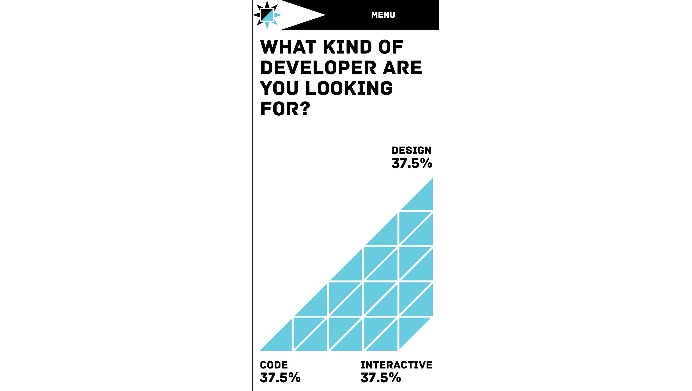
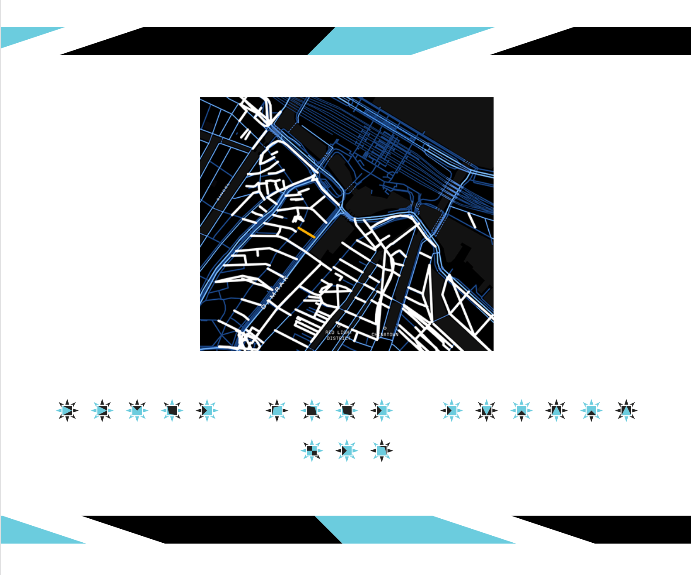
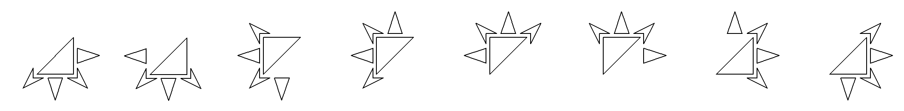
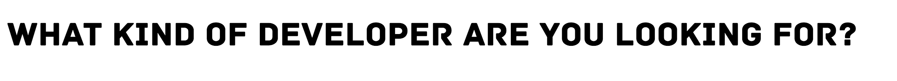
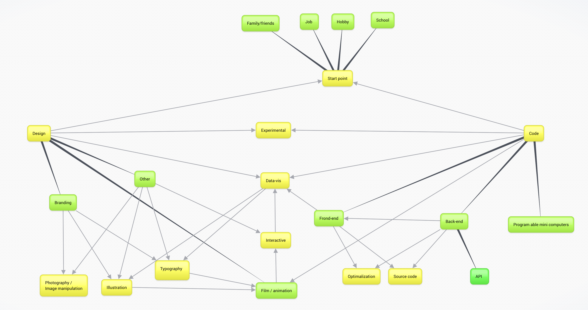
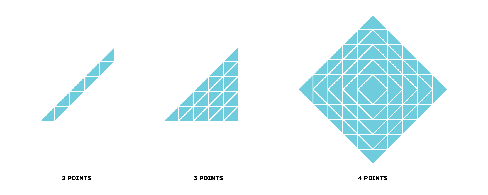
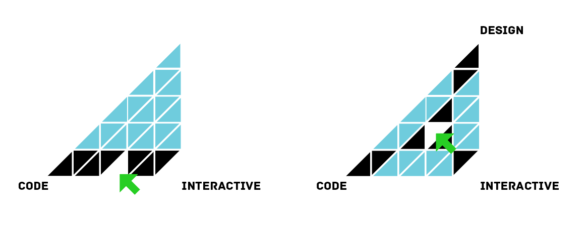

# Portfolio Taal der vormen

This project is about creating a portfolio which is specific for a user/users. Not just a fictive persona or target audience.

In this case the users:
- Marie
- Janjaap



Version 1.0.0 (alpha)

## Table of contents
- [Taal der vormen](#taal-der-vormen)

## Taal der vormen
The branding `Taal der vormen` is my personal style, which I have been developing during a internship. When you translate `Taal der vormen` to English, it will result in: `language of forms`. Which is actualy the main concept. There is literally a language of forms/shapes. It is used in the website to name the projects.




## Focus on the user Marie

### Interview

Questions prepared:
- Do you always know when a web page has been fully loaded, when you do not completely focus on the screen? (especially when you are having a conversation with somebody next to you)
- Some devices making a warning sounds when an action is considered invalid. Did you ever had the problem that they were only given by audio? (or anything related)
- Do you think that audio is important for using the web/devices?
- Do you consider phone numbers (on websites) useless?

For the interview I had two important questions. The first one was a global question was to confirm that people with a hearing disability can only focus on one thing at the time. In a lot of articles this is mentioned as an issue. 

- [x] Confirmed that people with hearing disability can only focus on one thing at the time.

The second question was more in to the direction of feedback from devices. One of the issues I had with having bad (mobile) reception is that I am waiting very long for the screen to load. Which isn't really a problem. But for somebody that can only focus on one thing at the same time, the minimal visible loading feedback can be a little bit tricky.

- [x] Confirmed that the idea of increasing the loading and loaded contrast might be an improvement.


### Scenario
Marie, a (motion) designer who is creative, flexible and humorous. She also has an open mind and is willing to learn new things. The boss asks her if she could check the portfolio website of a designer who did made a recent job request. She opens her laptop and clicks on the link her boss send her. The web browser starts to load the page and a website called “Taal der vormen” shows up. Before the website loaded completely, it indicates very clearly that the page has been fully loaded…

### Prepare product and make changes

Possible product for an improvement.
- Fullscreen loader. (exclusive the navigation: [Keep the user in control](http://bokardo.com/principles-of-user-interface-design/))

<details>
    <summary>Critical css (+ image) loader</summary>
    
</details>

---


Illustrator outline of de loader.


The loader image that will be used for the loader.

---

To make sure the loader shows as first, the image had to be encoded with base64 and applied in to the critical css.
```CSS
background:url("data:image/svg+xml;base64,PHN2ZyBkYXRhLW5hbWU9IkxhYWcgMSIgeG1sbnM9Imh0dHA6Ly93d3cudzMub3JnLzIwMDAvc3ZnIiB2aWV3Qm94PSIwIDAgMzIwMCA0MDAiPgogIDxwYXRoIGZpbGw9IiNmZmYiIGQ9Ik0zMDY1LjIxIDEzMy43OWwtMTMwLjQyIDEzMC40MmgxMzAuNDJWMTMzLjc5ek0zMDI2LjA4IDI3Ny4yNWgtNTIuMTZMMzAwMCAzNTUuNWwyNi4wOC03OC4yNXpNMzA3OC4yNSAxNzIuOTJ2NTIuMTZMMzE1Ni41IDE5OWwtNzguMjUtMjYuMDh6Ii8+CiAgPHBhdGggZmlsbD0iI2ZmZiIgZD0iTTMwNzguMjUgMjQxLjQ5djM1Ljc2aC0zNi4zMmw3Mi43IDM2LjY2LTM2LjM4LTcyLjQyek0zMDc4LjI1IDE1Ni43NWwzNi4zOC03Mi41NC03Mi43IDM2LjU0aDM2LjMydjM2ek0yNjY1LjIxIDEzMy43OWwtMTMwLjQyIDEzMC40MmgxMzAuNDJWMTMzLjc5ek0yNjAwIDQyLjVsLTI2LjA4IDc4LjI1aDUyLjE2TDI2MDAgNDIuNXpNMjY3OC4yNSAxNzIuOTJ2NTIuMTZMMjc1Ni41IDE5OWwtNzguMjUtMjYuMDh6Ii8+CiAgPHBhdGggZmlsbD0iI2ZmZiIgZD0iTTI2NzguMjUgMjQxLjQ5djM1Ljc2aC0zNi4zMmw3Mi43IDM2LjY2LTM2LjM4LTcyLjQyek0yNjc4LjI1IDE1Ni43NWwzNi4zOC03Mi41NC03Mi43IDM2LjU0aDM2LjMydjM2ek0yMTM0Ljc5IDEzMy43OXYxMzAuNDJsMTMwLjQyLTEzMC40MmgtMTMwLjQyek0yMjAwIDQyLjVsLTI2LjA4IDc4LjI1aDUyLjE2TDIyMDAgNDIuNXpNMjI3OC4yNSAxNzIuOTJ2NTIuMTZMMjM1Ni41IDE5OWwtNzguMjUtMjYuMDh6Ii8+CiAgPHBhdGggZmlsbD0iI2ZmZiIgZD0iTTIyNzguMjUgMTU2Ljc1bDM2LjM4LTcyLjU0LTcyLjcgMzYuNTRoMzYuMzJ2MzZ6TTIxMjEuNzUgMTIwLjc1aDM2LjM4bC03Mi43My0zNi41NCAzNi4zNSA3Mi41NHYtMzZ6TTE3MzQuNzkgMTMzLjc5djEzMC40MmwxMzAuNDItMTMwLjQyaC0xMzAuNDJ6TTE4MDAgNDIuNWwtMjYuMDggNzguMjVoNTIuMTZMMTgwMCA0Mi41ek0xNzIxLjc1IDE3Mi45MkwxNjQzLjUgMTk5bDc4LjI1IDI2LjA4di01Mi4xNnoiLz4KICA8cGF0aCBmaWxsPSIjZmZmIiBkPSJNMTg3OC4yNSAxNTYuNzVsMzYuMzgtNzIuNTQtNzIuNyAzNi41NGgzNi4zMnYzNnpNMTcyMS43NSAxMjAuNzVoMzYuMzhsLTcyLjczLTM2LjU0IDM2LjM1IDcyLjU0di0zNnpNMTMzNC43OSAxMzMuNzl2MTMwLjQybDEzMC40Mi0xMzAuNDJoLTEzMC40MnpNMTQwMCA0Mi41bC0yNi4wOCA3OC4yNWg1Mi4xNkwxNDAwIDQyLjV6TTEzMjEuNzUgMTcyLjkyTDEyNDMuNSAxOTlsNzguMjUgMjYuMDh2LTUyLjE2eiIvPgogIDxwYXRoIGZpbGw9IiNmZmYiIGQ9Ik0xMzIxLjc1IDI3Ny4yNVYyNDEuNWwtMzYuMzUgNzIuNDEgNzIuNzMtMzYuNjZoLTM2LjM4ek0xMzIxLjc1IDEyMC43NWgzNi4zOGwtNzIuNzMtMzYuNTQgMzYuMzUgNzIuNTR2LTM2ek05MzQuNzkgMTMzLjc5djEzMC40MmwxMzAuNDItMTMwLjQySDkzNC43OXpNMTAyNi4wOCAyNzcuMjVoLTUyLjE2TDEwMDAgMzU1LjVsMjYuMDgtNzguMjV6TTkyMS43NSAxNzIuOTJMODQzLjUgMTk5bDc4LjI1IDI2LjA4di01Mi4xNnoiLz4KICA8cGF0aCBmaWxsPSIjZmZmIiBkPSJNOTIxLjc1IDI3Ny4yNVYyNDEuNWwtMzYuMzUgNzIuNDEgNzIuNzMtMzYuNjZoLTM2LjM4ek05MjEuNzUgMTIwLjc1aDM2LjM4TDg4NS40IDg0LjIxbDM2LjM1IDcyLjU0di0zNnpNNjY1LjIxIDEzNS4zMUw1MzQuNzkgMjY1LjczaDEzMC40MlYxMzUuMzF6TTYyNi4wOCAyNzguNzdoLTUyLjE2TDYwMCAzNTcuMDJsMjYuMDgtNzguMjV6TTUyMS43NSAxNzQuNDNsLTc4LjI1IDI2LjA5IDc4LjI1IDI2LjA4di01Mi4xN3oiLz4KICA8cGF0aCBmaWxsPSIjZmZmIiBkPSJNNjc4LjI1IDI0My4wMXYzNS43NmgtMzYuMzJsNzIuNyAzNi42NS0zNi4zOC03Mi40MXpNNTIxLjc1IDI3OC43N3YtMzUuNzZsLTM2LjM1IDcyLjQxIDcyLjczLTM2LjY1aC0zNi4zOHpNMjY1LjIxIDEzMy43OUwxMzQuNzkgMjY0LjIxaDEzMC40MlYxMzMuNzl6TTIyNi4wOCAyNzcuMjVoLTUyLjE2TDIwMCAzNTUuNWwyNi4wOC03OC4yNXpNMjc4LjI1IDE3Mi45MnY1Mi4xNkwzNTYuNSAxOTlsLTc4LjI1LTI2LjA4eiIvPgogIDxwYXRoIGZpbGw9IiNmZmYiIGQ9Ik0yNzguMjUgMjQxLjQ5djM1Ljc2aC0zNi4zMmw3Mi43IDM2LjY2LTM2LjM4LTcyLjQyek0xMjEuNzUgMjc3LjI1VjI0MS41TDg1LjQgMzEzLjkxbDcyLjczLTM2LjY2aC0zNi4zOHoiLz4KPC9zdmc+Cg==") 0 0;
```

A usefull tool to make critical images: 
[dopiaza](https://dopiaza.org/tools/datauri/index.php)

### Test plan

#### Focus on 3 aspects
While testing I will be mainly focus on 3 aspects.
1. Is the loader of the page considered usefull or annoying?
2. Is the user able to visit every page of choice without problems?
3. Is the content sort/filter system clear for the user?

#### Setup
- Mobile device testing (mobile first design)
- Camera + tripod (Thanks [Vincent K.](https://github.com/VincentKempers) !)

#### Tasks
The user shouldn't receive tasks for this website. Because the user comes to a portfolio website for a single purpose, which is viewing a few interesting projects to judge the creator his abilities/skills.

So `NO tasks` and `Figure it out on your own!`


## Focus on the user Janjaap

### What kind of developer are you looking for?



While designing this website, I came to the conclusion that I do not know sure which user is going to view this website. So in my opinion it is logic that the user can find the content that she/he is looking for.

Koop R. suggested me to send only the content the user is interested in. Which is a very good idea. Keeps things very to the point. In this design I haven't implemented that idea yet, because I wanted to test an experimental filter/sort system. 


### Process of experimental filter/sort system

Jorik: `"Never judge a user his content preferences by his/her job function."`


#### Collecting content
Before starting with the filter/sort system, collecting the content first is required.

<details>
    <summary>Website content collection progress <time>2018-04-25</time></summary>
    
    
    
</details>

#### Card sorting
-- card sorting photo coming soon --

#### Mind map with relations

[Mind map made with bubbl](https://bubbl.us/)


---

#### Data selection grids



<details>
    <summary>How does it looks like?</summary>
    
    <p>Code only</p>
     
    <p>50% code and 50% design</p>
    
    <p>Design only</p>
</details>

---

#### Alternative designs


In this 3 points example the selected area becomes white and the paths towards it become black.

<details>
    <summary>Alternative with 4 points</summary>
    
    <p>In this 4 points example the selected area remains black and the paths towards it become also black.</p>
</details>

## Testing with Marie

Known issues: (before testing)
- Buttons are of data selection grid might not be considered as buttons. [UI/UX Principle #19](https://www.freshconsulting.com/uiux-principle-19-buttons-should-look-like-buttons-links-should-look-like-links/)
- The language icons on the projects confuse the user on a smartphone because they do not swap with the titles. (which normaly happens when hovering over a project)

[](https://www.youtube.com/watch?v=bOpz7gy73bY&feature=youtu.be)

[Video: Testing web app](https://www.youtube.com/watch?v=bOpz7gy73bY&feature=youtu.be)

Testing device: Smartphone.

Issues:
- Buttons are of data selection grid are not considered as buttons. (which was to be expected)
- The language icons on the projects are surprisely considered as buttons. (Very confusing for the user)


## Todo
- [ ] Solve % issue, on "What kind of developer are you looking for?" Not all values are correct.
- [ ] Buttons must look like buttons and created in the "Taal der vormen" style.