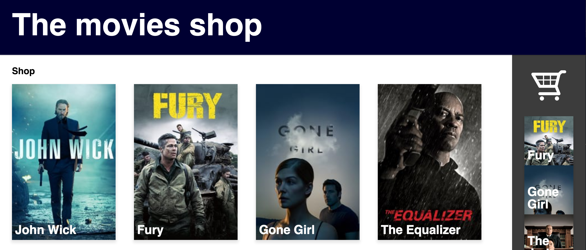
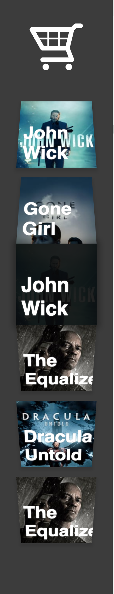

# web-design

## What can I do on this website?

Buying movies!

    
Older version

    
    
"Order movies ofcourse!" That is what the title says atleast.

### Make the title BIGGER? 

- [ ] Bigger?
- [ ] Or smaller?

---

## Missing some clarity

This interface is missing some clarity about how to order shop items. A zero state might be handy in this case.

Need:
`16. A crucial moment: the zero state`

- [ ] Zero state (partly added)

---

## Dominates on item text, which becomes visible when hover over it

`11. Strong visual hierarchies work best`

While hovering over an item, it will hide the image and show the title large on top. This will make the item the most visible element on the interface. The title which is ridiculously big gives the item even more attention. There is also a low visible background shadow which lift the item up.

Hover over an item

    
Older version

    

---

## Dagging (+ zero state)

`5. Direct manipulation is best` 

 

`6. One primary action per screen`

Wouldn't it be nice to drag things?

While hovering, the zero-state becomes visible on right bottom.

    
Older version

    

Adding a lift-up animation which will makes the content fly a bit up, like you can grab it.

When dragging
- [X] Do not show the raster on the list where the item is located at the moment.
- [X] Lift-up animation.
- [ ] Label. (Drag to here / Add to order list / Delete)
- [ ] Trash bin Icon might help supporting the label.
- [ ] Tested with users.

---

## Experimental item list hierarchy

I wanted the items `before` and `after` the targeted element, having different styling. By using a matrix you can create nice looking perspective styling.
A tool to generate matrix CSS code: [matrix3d](http://ds-overdesign.com/transform/matrix3d.html) 