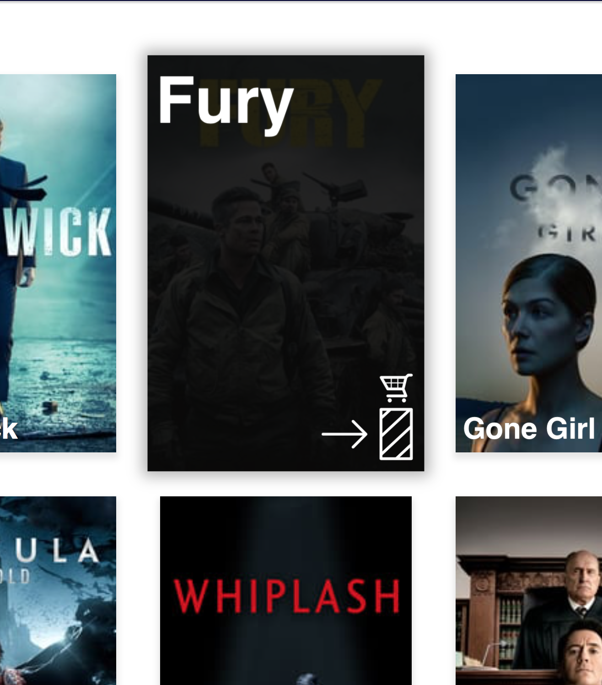

# web-design
[Website](https://iiyama12.github.io/web-design/website)


## What can I do on this website?


Buying movies ofcourse! 
Which is not yet possible unfortunately, but you can drag and drop items to your shopping list.


### Drag and drop implementation
I have never implemented the drag and drop features in one of my websites before. So this was a new experience for me. And I am impressed that it isn't very easy to build it correctly. There are so many things can go wrong and all related to the browser default behaviour. At the end I made a terrible mistake by removing the pointer events from the element that I was dragging, this caused Firefox to Glitch out and the drag/drop events were broken on that tab.


<details>
    <summary>Older version</summary>
    
    <p>"Order movies ofcourse!" That is what the title says atleast.</p>
</details>

### Make the title BIGGER? 

- [ ] Bigger?
- [ ] Or smaller?

---

## Missing some clarity

This interface is missing some clarity about how to order shop items. A zero state might be handy in this case.

Need:
`16. A crucial moment: the zero state`

- [ ] Zero state (partly added)


---

## Dominates on item text, which becomes visible when hover over it

`11. Strong visual hierarchies work best`

While hovering over an item, it will hide the image and show the title large on top. This will make the item the most visible element on the interface. The title which is ridiculously big gives the item even more attention. There is also a low visible background shadow which lift the item up.



Hover over an item

<details>
    <summary>Older version</summary>
    
</details>

---

## Dagging (+ zero state)

`5. Direct manipulation is best` 

<br>

`6. One primary action per screen`

Wouldn't it be nice to drag things?


While hovering, the zero-state becomes visible on right bottom.

<details>
    <summary>Older version</summary>
    
</details>


Adding a lift-up animation which will makes the content fly a bit up, like you can grab it.


When dragging
- [X] Do not show the raster on the list where the item is located at the moment.
- [X] Lift-up animation.
- [ ] Label. (Drag to here / Add to order list / Delete)
- [ ] Trash bin Icon might help supporting the label.
- [ ] Tested with users.


---

## Experimental item list hierarchy

<details>
    <summary>Experimental item list</summary>
    
</details>

I wanted the items `before` and `after` the targeted element, having different styling. By using a matrix you can create nice looking perspective styling.
A tool to generate matrix CSS code: [matrix3d](http://ds-overdesign.com/transform/matrix3d.html) 

---

## Aside fixed and full screen height when scrolling down.

It is important to keep the user in control of the primary controls. Which is in this case drag and drop. In this prototype, the user has to drag an item from the shopping list and drop it in to the shopping-cart area. In order to keep the this control primary, the user must always have access to it. So for this design I desided to keep your shopping-cart area always fixed on the right side of the screen.

<details>
    <summary>Aside with the scroll position on top.</summary>
    
</details>

<details>
    <summary>Aside with the scroll position a little bit lower than top.</summary>
    
    <p>Javascript will re-calculate the start position and height of the shopping-cart area.</p>
</details>  

---

## Extra

### Real data (API)

```JS
    fetch("https://api.themoviedb.org/3/discover/movie?primary_release_date.gte=2014-09-15&primary_release_date.lte=2014-10-22&api_key=XXXXXXXX")
    .then(function(response) {
        return response.json();
    })
    .then(function(myJson) {
        console.log("templateEngine", templateEngine, myJson);
        
        templateEngine.render(template, document.getElementById("shop-list"), myJson.results);
    }).catch(function (error) {
        console.log(error);
    });
```

Receiving live movie data while reloading the page.

---

### Custom template engine / Javascript DOM builder

```HTML
<script src="https://iiyama12.github.io/template-engine/template-engine.js"></script>
```
Add the script

---

```JS
const template = [
    {
        content: function (data) {
            const itemsWithData = [];
            for (let i = 0; i < data.length; i++) {
                const newElement = document.createElement("li");
                newElement.setAttribute("draggable", "true")
                itemsWithData[itemsWithData.length] = {element: newElement, data: data[i] }
                handleDrag.setDragListenersForItem(newElement);
            }
            return itemsWithData;
        },
        type: "function",
        children: [
            {
                content: "h3",
                type: "tag",
                child: {
                    type: "function",
                    content: function (data, parent) {
                        parent.textContent = data.title;
                        
                    }
                }
            },
            {
                content: "img",
                type: "tag",
                child: {
                    type: "function",
                    content: function (data, parent) {
                        parent.src = "http://image.tmdb.org/t/p/w185/" + data.poster_path;
                        parent.alt = data.title;
                    }
                }
            },
            {
                content: "img",
                type: "tag",
                child: {
                    type: "function",
                    content: function (data, parent) {
                        parent.src = "img/drag-instruction.svg";
                        parent.alt = "Drag instruction";
                        parent.classList.add("drag-instruction");
                    }
                }
            }
        ]
    }
];
```
Make your `template`/`instruction code`

---

```JS
templateEngine.render(template, document.getElementById("shop-list"), myJson.results);
```

Render the content

---

Documentation can be found here: [Template engine / DOM builder](https://iiyama12.github.io/template-engine)