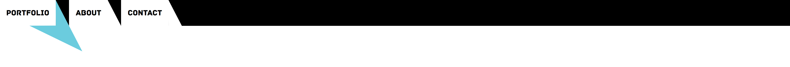

# Portfolio Taal der vormen

-- intro --


## Table of contents
- [Taal der vormen](#taal-der-vormen)

## Taal der vormen
The branding `Taal der vormen` is my personal style, which I have been developing during a internship. When you translate `Taal der vormen` to English, it will result in: `language of forms`. Which is actualy the main concept. There is literally a language of forms/shapes. It is used in the website to name the projects.


## Focus on the user Marie

### Interview

For the interview I had two questions. The first one was a global question was to confirm that people with a hearing disability can only focus on one thing at the time. In a lot of articles this is mentioned as an issue. 

- [x] Confirmed that people with hearing disability can only focus on one thing at the time.

The second question was more in to the direction of feedback from devices. One of the issues I had with having bad (mobile) reception is that I am waiting very long for the screen to load. Which isn't really a problem. But for somebody that can only focus on one thing at the same time, the minimal visible loading feedback can be a little bit tricky.

- [x] Confirmed that the idea of increasing the loading and loaded contrast might be an improvement.


### Prepare product and make changes

Possible product for an improvement.
- Fullscreen loader. (exclusive the navigation: [Keep the user in control](http://bokardo.com/principles-of-user-interface-design/))

<details>
    <summary>Critical css (+ image) loader</summary>
    
</details>

---


Illustrator outline of de loader.


The loader image that will be used for the loader.

---

To make sure the loader shows as first, the image had to be encoded with base64 and applied in to the critical css.
```CSS
background:url("data:image/svg+xml;base64,PHN2ZyBkYXRhLW5hbWU9IkxhYWcgMSIgeG1sbnM9Imh0dHA6Ly93d3cudzMub3JnLzIwMDAvc3ZnIiB2aWV3Qm94PSIwIDAgMzIwMCA0MDAiPgogIDxwYXRoIGZpbGw9IiNmZmYiIGQ9Ik0zMDY1LjIxIDEzMy43OWwtMTMwLjQyIDEzMC40MmgxMzAuNDJWMTMzLjc5ek0zMDI2LjA4IDI3Ny4yNWgtNTIuMTZMMzAwMCAzNTUuNWwyNi4wOC03OC4yNXpNMzA3OC4yNSAxNzIuOTJ2NTIuMTZMMzE1Ni41IDE5OWwtNzguMjUtMjYuMDh6Ii8+CiAgPHBhdGggZmlsbD0iI2ZmZiIgZD0iTTMwNzguMjUgMjQxLjQ5djM1Ljc2aC0zNi4zMmw3Mi43IDM2LjY2LTM2LjM4LTcyLjQyek0zMDc4LjI1IDE1Ni43NWwzNi4zOC03Mi41NC03Mi43IDM2LjU0aDM2LjMydjM2ek0yNjY1LjIxIDEzMy43OWwtMTMwLjQyIDEzMC40MmgxMzAuNDJWMTMzLjc5ek0yNjAwIDQyLjVsLTI2LjA4IDc4LjI1aDUyLjE2TDI2MDAgNDIuNXpNMjY3OC4yNSAxNzIuOTJ2NTIuMTZMMjc1Ni41IDE5OWwtNzguMjUtMjYuMDh6Ii8+CiAgPHBhdGggZmlsbD0iI2ZmZiIgZD0iTTI2NzguMjUgMjQxLjQ5djM1Ljc2aC0zNi4zMmw3Mi43IDM2LjY2LTM2LjM4LTcyLjQyek0yNjc4LjI1IDE1Ni43NWwzNi4zOC03Mi41NC03Mi43IDM2LjU0aDM2LjMydjM2ek0yMTM0Ljc5IDEzMy43OXYxMzAuNDJsMTMwLjQyLTEzMC40MmgtMTMwLjQyek0yMjAwIDQyLjVsLTI2LjA4IDc4LjI1aDUyLjE2TDIyMDAgNDIuNXpNMjI3OC4yNSAxNzIuOTJ2NTIuMTZMMjM1Ni41IDE5OWwtNzguMjUtMjYuMDh6Ii8+CiAgPHBhdGggZmlsbD0iI2ZmZiIgZD0iTTIyNzguMjUgMTU2Ljc1bDM2LjM4LTcyLjU0LTcyLjcgMzYuNTRoMzYuMzJ2MzZ6TTIxMjEuNzUgMTIwLjc1aDM2LjM4bC03Mi43My0zNi41NCAzNi4zNSA3Mi41NHYtMzZ6TTE3MzQuNzkgMTMzLjc5djEzMC40MmwxMzAuNDItMTMwLjQyaC0xMzAuNDJ6TTE4MDAgNDIuNWwtMjYuMDggNzguMjVoNTIuMTZMMTgwMCA0Mi41ek0xNzIxLjc1IDE3Mi45MkwxNjQzLjUgMTk5bDc4LjI1IDI2LjA4di01Mi4xNnoiLz4KICA8cGF0aCBmaWxsPSIjZmZmIiBkPSJNMTg3OC4yNSAxNTYuNzVsMzYuMzgtNzIuNTQtNzIuNyAzNi41NGgzNi4zMnYzNnpNMTcyMS43NSAxMjAuNzVoMzYuMzhsLTcyLjczLTM2LjU0IDM2LjM1IDcyLjU0di0zNnpNMTMzNC43OSAxMzMuNzl2MTMwLjQybDEzMC40Mi0xMzAuNDJoLTEzMC40MnpNMTQwMCA0Mi41bC0yNi4wOCA3OC4yNWg1Mi4xNkwxNDAwIDQyLjV6TTEzMjEuNzUgMTcyLjkyTDEyNDMuNSAxOTlsNzguMjUgMjYuMDh2LTUyLjE2eiIvPgogIDxwYXRoIGZpbGw9IiNmZmYiIGQ9Ik0xMzIxLjc1IDI3Ny4yNVYyNDEuNWwtMzYuMzUgNzIuNDEgNzIuNzMtMzYuNjZoLTM2LjM4ek0xMzIxLjc1IDEyMC43NWgzNi4zOGwtNzIuNzMtMzYuNTQgMzYuMzUgNzIuNTR2LTM2ek05MzQuNzkgMTMzLjc5djEzMC40MmwxMzAuNDItMTMwLjQySDkzNC43OXpNMTAyNi4wOCAyNzcuMjVoLTUyLjE2TDEwMDAgMzU1LjVsMjYuMDgtNzguMjV6TTkyMS43NSAxNzIuOTJMODQzLjUgMTk5bDc4LjI1IDI2LjA4di01Mi4xNnoiLz4KICA8cGF0aCBmaWxsPSIjZmZmIiBkPSJNOTIxLjc1IDI3Ny4yNVYyNDEuNWwtMzYuMzUgNzIuNDEgNzIuNzMtMzYuNjZoLTM2LjM4ek05MjEuNzUgMTIwLjc1aDM2LjM4TDg4NS40IDg0LjIxbDM2LjM1IDcyLjU0di0zNnpNNjY1LjIxIDEzNS4zMUw1MzQuNzkgMjY1LjczaDEzMC40MlYxMzUuMzF6TTYyNi4wOCAyNzguNzdoLTUyLjE2TDYwMCAzNTcuMDJsMjYuMDgtNzguMjV6TTUyMS43NSAxNzQuNDNsLTc4LjI1IDI2LjA5IDc4LjI1IDI2LjA4di01Mi4xN3oiLz4KICA8cGF0aCBmaWxsPSIjZmZmIiBkPSJNNjc4LjI1IDI0My4wMXYzNS43NmgtMzYuMzJsNzIuNyAzNi42NS0zNi4zOC03Mi40MXpNNTIxLjc1IDI3OC43N3YtMzUuNzZsLTM2LjM1IDcyLjQxIDcyLjczLTM2LjY1aC0zNi4zOHpNMjY1LjIxIDEzMy43OUwxMzQuNzkgMjY0LjIxaDEzMC40MlYxMzMuNzl6TTIyNi4wOCAyNzcuMjVoLTUyLjE2TDIwMCAzNTUuNWwyNi4wOC03OC4yNXpNMjc4LjI1IDE3Mi45MnY1Mi4xNkwzNTYuNSAxOTlsLTc4LjI1LTI2LjA4eiIvPgogIDxwYXRoIGZpbGw9IiNmZmYiIGQ9Ik0yNzguMjUgMjQxLjQ5djM1Ljc2aC0zNi4zMmw3Mi43IDM2LjY2LTM2LjM4LTcyLjQyek0xMjEuNzUgMjc3LjI1VjI0MS41TDg1LjQgMzEzLjkxbDcyLjczLTM2LjY2aC0zNi4zOHoiLz4KPC9zdmc+Cg==") 0 0;
```

A usefull tool to make critical images: 
[dopiaza](https://dopiaza.org/tools/datauri/index.php)

### Test plan


## Focus on Company employees, who check portfolio websites

### What kind of developer are you looking for?


Heading level 2. (might become level 1)

While designing this website, I came to the conclusion that I do not know sure which user is going to view this website. So in my opinion it is logic that the user can find the content that she/he is looking for.

Koop R. suggested me to send only the content the user is interested in. Which is a very good idea. Keeps things very to the point. In this design I haven't implemented that idea yet, because I wanted to test an experimental filter/sort system. 


### Process of experimental filter/sort system


#### Collecting content
Before starting with the filter/sort system, collecting the content first is required.

<details>
    <summary>Website content collection progress <time>2018-04-25</time></summary>
    
    
    
</details>

#### Card sorting
-- card sorting photo coming soon --

#### Mind map with relations

[Mind map made with bubbl](https://bubbl.us/)




#### Data selection grids


<details>
    <summary>Used example</summary>
    
     
    
</details>


In this 3 points example the selected area becomes white and the paths towards it become black.

<details>
    <summary>Alternative with 4 points</summary>
    
    <p>In this 4 points example the selected area remains black and the paths towards it become also black.</p>
</details>

## Testing with Marie


base url
https://github.com/IIYAMA12/web-design/blob/master/readme-content/

## Todo
- [ ] Solve % issue, on "What kind of developer are you looking for?" Not all values are correct.
- [ ] Buttons must look like buttons and created in the "Taal der vormen" style.