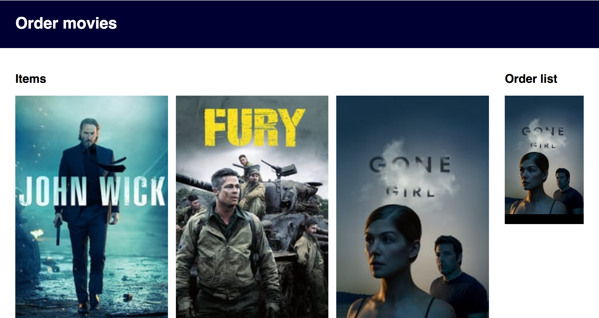
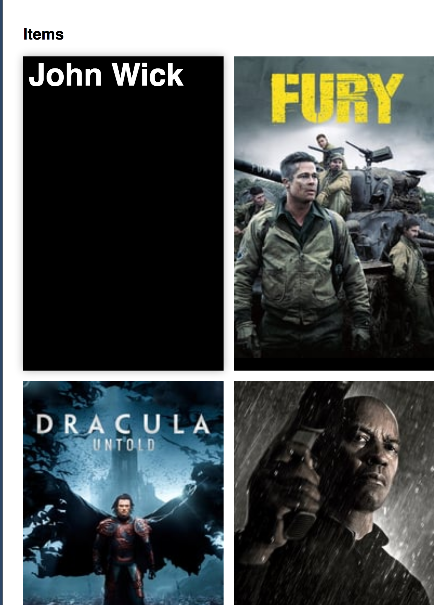
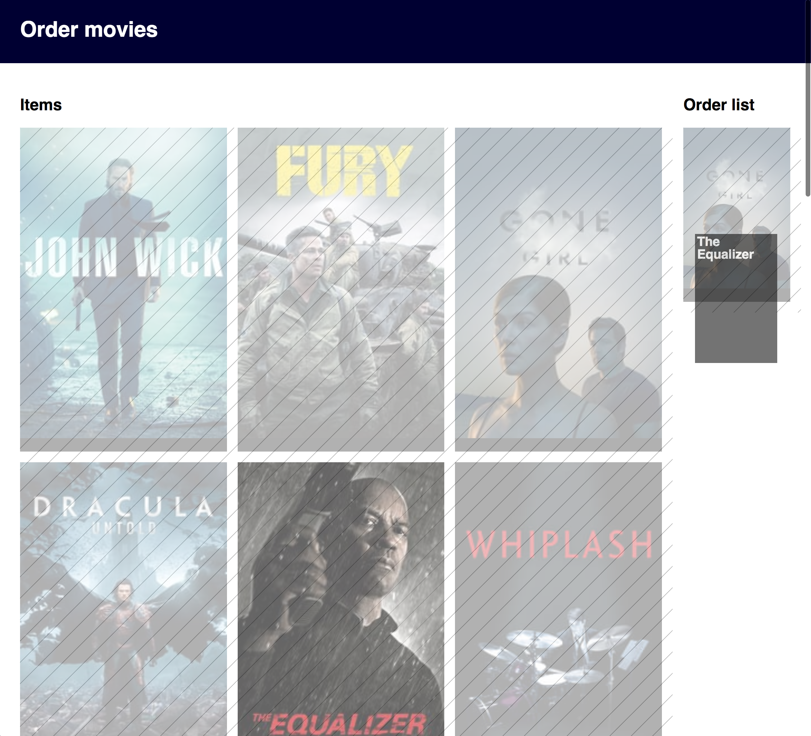

# web-design

## What can I do on this website?
"Order movies ofcourse!" That is what the title says atleast.

The title BIGGER? 

- [ ] Bigger?
- [ ] Or smaller?

---

## Missing some clarity

This interface is missing some clarity about how to order shop items. A zero state might be handy in this case.

Need:
`16. A crucial moment: the zero state`

- [ ] Zero state

---

## Dominates on item, which becomes visible hover over it

`11. Strong visual hierarchies work best`

By hidding the image and only show the title, it will make the item the most visible element on the interface. The title which is ridiculously big gives the item even more attention. There is also a low visible background shadow which lift the item up.

Too much or just enough?

---

## Dagging

`5. Direct manipulation is best`
`6. One primary action per screen`

Wouldn't it be nice to drag things? 

When dragging
- [ ] Do not show the raster on the list where the item is located at the moment.
- [ ] Label. (Drag to here / Add to order list / Delete)
- [ ] Trash bin Icon might help supporting the label.

